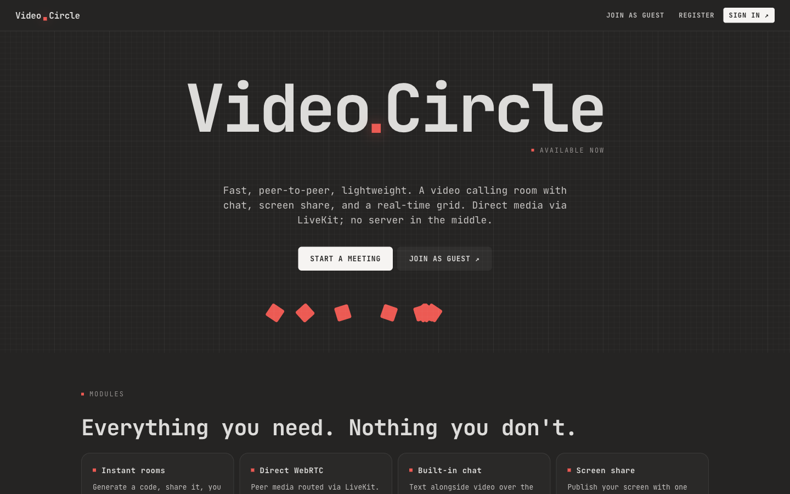
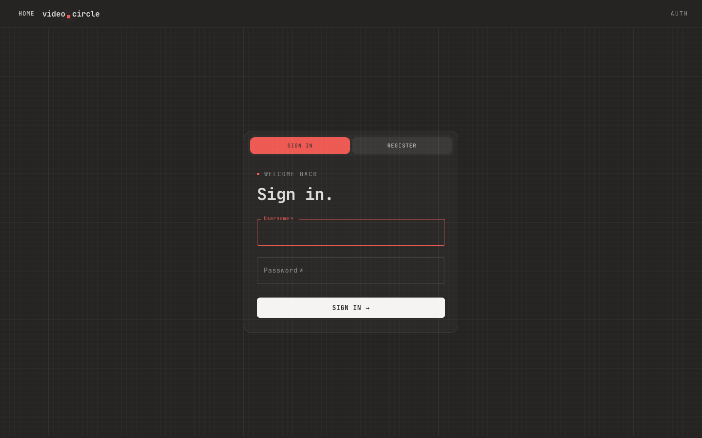
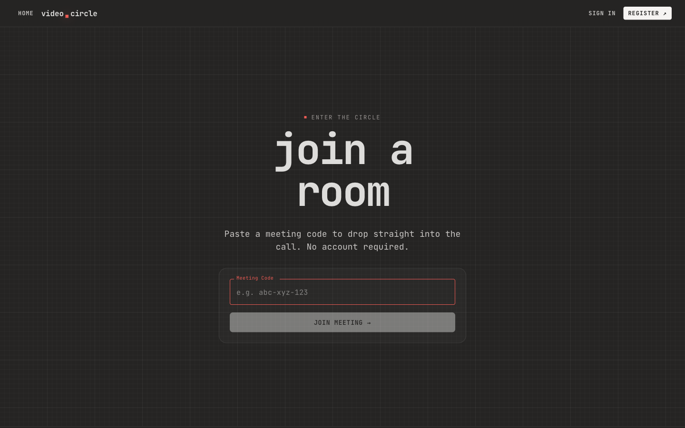
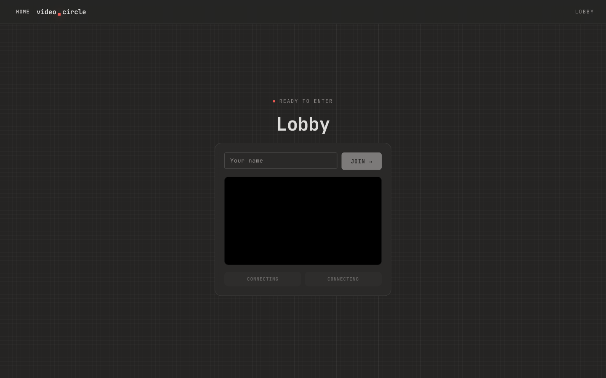
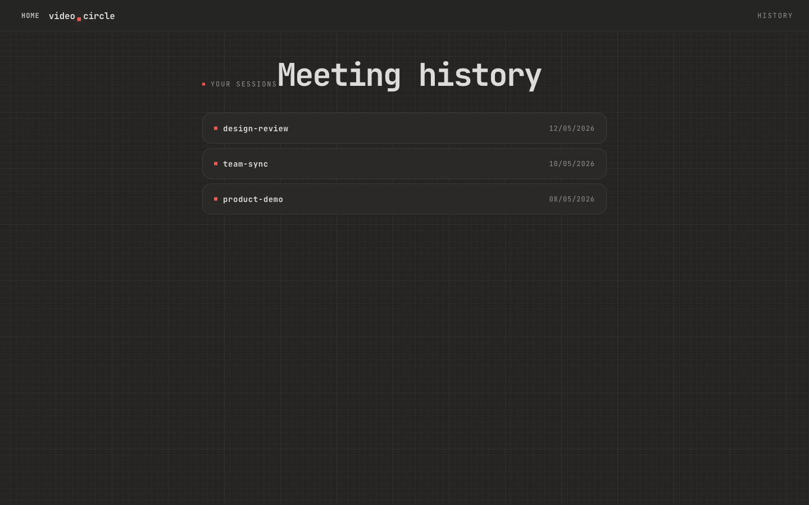
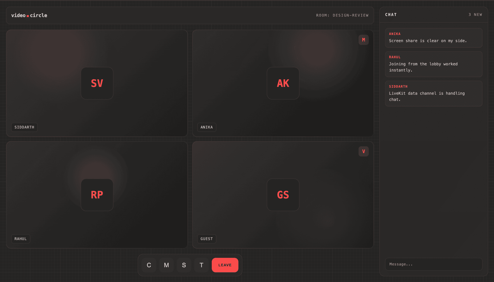

<div align="center">

  <h1>VideoCircle</h1>

  <p><strong>A real-time video conferencing platform for the browser — instant rooms, WebRTC media, and a signal-grid interface.</strong></p>

  <p>
    <a href="https://videocircle.onrender.com" target="_blank">
      
    </a>
  </p>

  <p>
    
    
    
    
    
    
  </p>
</div>

---

## Overview

**VideoCircle** is a full-stack video conferencing application that runs entirely in the browser — no downloads, no plugins, no proxy server in the media path. Users create or join a room with a single code; the backend issues short-lived LiveKit JWTs and the browser opens a direct WebRTC connection to the LiveKit Cloud SFU for video, audio, screen share, and in-call chat.

The product is built around a minimal, opinionated visual system — warm near-black surfaces, red signal accents, JetBrains Mono typography, and CSS-grid backdrops — and a clean separation between the thin REST API and the real-time media plane.

**Live demo:** [videocircle.onrender.com](https://videocircle.onrender.com)

> ⏱ The demo runs on Render's free tier — both services sleep after ~15 minutes of inactivity. The first request after a sleep can take 30–60 seconds to wake the backend; subsequent requests are instant.

---

## Screenshots

<div align="center">
  
  <p><sub><em>Landing — product entry point with guest, register, and sign-in paths.</em></sub></p>
</div>

<div align="center">
  
  <p><sub><em>Auth — sign-in / register on the same surface with token-based sessions.</em></sub></p>
</div>

<div align="center">
  
  <p><sub><em>Guest — paste a meeting code and drop into a room without an account.</em></sub></p>
</div>

<div align="center">
  
  <p><sub><em>Lobby — local camera preview, mic/camera toggles, and name entry before joining.</em></sub></p>
</div>

<div align="center">
  
  <p><sub><em>History — every authenticated session is logged and listed in reverse chronological order.</em></sub></p>
</div>

<div align="center">
  
  <p><sub><em>In-call — adaptive video grid, compact controls, and data-channel chat.</em></sub></p>
</div>

---

## Key features

- **Instant rooms** — generate a code, share the URL, and anyone can join the same room from any device.
- **Direct WebRTC media** — peer media is routed via LiveKit Cloud (SFU); the backend never proxies audio or video.
- **Pre-call lobby** — camera preview, mic/camera toggles, and name entry before connecting.
- **Adaptive video grid** — simulcast + adaptive bitrate via LiveKit, falling back gracefully for slow links.
- **Screen sharing** — publish your screen to all participants with one click.
- **In-call chat** — real-time text over LiveKit's data channel (no separate WebSocket server).
- **Guest access** — join meetings without registering; sign in only when you want history.
- **Meeting history** — authenticated users get an automatic log of every room they've joined.
- **Token-based auth** — bcrypt-hashed passwords, 7-day session tokens, central `requireAuth` middleware.
- **Signal-grid UI** — warm near-black surfaces, red `#ff4b4b` accents, JetBrains Mono typography, CSS-grid backdrops.

---

## Engineering highlights

- **Two unrelated auth systems, deliberately not conflated.** App auth uses a 40-character hex token stored on the user document (lazy-expired on read); LiveKit auth uses a server-signed JWT with a 1-hour TTL. They live behind separate middleware and have separate failure modes.
- **Serverless-compatible backend.** Because chat runs over LiveKit's data channel, the Express API holds no persistent connections — it can be deployed to any Node host (Railway, Render, Fly, Vercel Functions, Lambda) without sticky sessions.
- **Single-source environment access.** Frontend env vars are read in exactly one file (`shared/lib/env.js`); backend env is validated once at boot (`config/env.js`). Scattered `process.env.*` reads are a lint-level smell here.
- **Phase-machine for meeting state.** `useMeetingRoom` cleanly separates `lobby → connecting → room`, including stopping the lobby's preview tracks before LiveKit reacquires the camera (Chrome refuses a second `getUserMedia` otherwise).
- **Layered backend.** Each module follows `route → validate (Zod) → middleware → controller → service → model`, with a central `errorHandler` that shapes every error into `{ status, message }`.
- **Catch-all routing for meeting codes.** `/:meetingCode` is intentionally registered last in the React router so any single-segment URL becomes a room — sharing a meeting is just sharing a link.
- **No global LiveKit token in storage.** The LiveKit JWT lives only in component state for the lifetime of the call; nothing about the room survives a refresh.

---

## Tech stack

| Layer                | Technology                                                         |
| -------------------- | ------------------------------------------------------------------ |
| **Frontend**         | React 18, React Router v6, Material-UI v5                          |
| **Real-time media**  | LiveKit Cloud (SFU), `@livekit/components-react`, `livekit-client` |
| **HTTP client**      | Axios (single instance with auth interceptor)                      |
| **Backend**          | Node.js, Express 5 (ESM), `livekit-server-sdk`                     |
| **Database**         | MongoDB Atlas via Mongoose                                         |
| **Validation**       | Zod                                                                |
| **Auth**             | bcrypt password hashing + crypto-hex session tokens                |
| **Tooling**          | ESLint 9, Prettier 3, Nodemon, PM2                                 |
| **Frontend hosting** | Vercel                                                             |
| **Backend hosting**  | Railway (serverless-compatible)                                    |

---

## Architecture

```
┌────────────────────────────────────────────────────────────────────┐
│  React App (Vercel)                                                │
│                                                                    │
│  ┌──────────────────┐   REST (Axios)     ┌──────────────────────┐ │
│  │  Auth / Home /   │ ─────────────────► │  Express API         │ │
│  │  History pages   │ ◄───────────────── │  (Railway)           │ │
│  └──────────────────┘  token, history    │                      │ │
│                                          │  MongoDB Atlas       │ │
│  ┌──────────────────┐  GET /get-token    │  ┌────────────────┐  │ │
│  │  MeetPage.jsx    │ ─────────────────► │  │ users          │  │ │
│  │  <LiveKitRoom>   │ ◄──── JWT ──────── │  │ meetings       │  │ │
│  └────────┬─────────┘                    └──────────────────────┘ │
│           │  WebRTC + WSS (LiveKit SDK)                            │
│           ▼                                                        │
│  ┌──────────────────────────────┐                                  │
│  │   LiveKit Cloud (SFU)        │                                  │
│  │   Video · Audio · Chat data  │                                  │
│  └──────────────────────────────┘                                  │
└────────────────────────────────────────────────────────────────────┘
```

**Media is never proxied through the backend.** The browser opens a WebRTC + WebSocket connection directly to LiveKit Cloud. The Express server only does two things: user auth + meeting history (MongoDB-backed), and issuing short-lived LiveKit JWTs.

### Authentication flow

1. User registers — password hashed with bcrypt (10 rounds) and stored in MongoDB.
2. On login the server generates a 40-character hex token with a 7-day expiry and returns it to the client.
3. The token is kept in `localStorage` (accessed only via `shared/lib/storage.js`) and sent on every request as `Authorization: Bearer <token>` by the shared Axios interceptor.
4. `requireAuth` validates the token on the backend; on the frontend `withAuth` calls `GET /api/v1/users/verify` on mount to gate protected pages.

### Video call flow

1. User opens `/home`, enters a meeting code, and navigates to `/:meetingCode`.
2. The **lobby** acquires a preview stream, lets the user toggle mic/camera and enter a name, then stops its tracks so LiveKit can reacquire the same devices.
3. The frontend calls `GET /api/v1/meet/get-token` to receive a JWT and the LiveKit WebSocket URL.
4. `<LiveKitRoom>` connects directly to LiveKit Cloud with `adaptiveStream`, `dynacast`, and `VideoPresets.h720`.
5. Tracks are published, subscribed, and simulcast-managed entirely by the LiveKit SDK.
6. Chat messages flow over LiveKit's data channel via `useChat()`.
7. On disconnect, the SDK tears down tracks and `onDisconnected` navigates the user home.

---

## Project structure

The frontend is organized by **feature folders** with a `shared/` cross-cutting layer; the backend follows a **layered architecture** (`config → middleware → modules`).

```
VideoCircle/
├── frontend/                                  # React CRA app (Vercel)
│   ├── public/screenshots/                    # README screenshots
│   └── src/
│       ├── app/
│       │   ├── App.jsx                        # mouse-parallax listener, mounts providers + routes
│       │   ├── providers.jsx                  # <BrowserRouter><ThemeProvider><AuthProvider>
│       │   └── routes.jsx                     # the only place routes are defined
│       ├── features/
│       │   ├── auth/                          # AuthPage, GuestLandingPage, AuthContext, withAuth
│       │   ├── home/pages/HomePage.jsx        # /home
│       │   ├── history/                       # HistoryPage + historyApi
│       │   ├── landing/pages/LandingPage.jsx  # /
│       │   └── meet/
│       │       ├── components/                # LobbyScreen, ConferenceGrid, MeetControls,
│       │       │                              # ChatPanel, LocalVideoPIP
│       │       ├── livekit/RoomShell.jsx      # wraps <LiveKitRoom> + RoomAudioRenderer
│       │       ├── livekit/tokenApi.js        # GET /api/v1/meet/get-token
│       │       ├── livekit/useMeetingRoom.js  # lobby | connecting | room phase machine
│       │       └── pages/MeetPage.jsx         # /:meetingCode
│       └── shared/
│           ├── lib/apiClient.js               # single Axios instance + Authorization interceptor
│           ├── lib/env.js                     # the only file that reads process.env.*
│           ├── lib/storage.js                 # wraps localStorage("token")
│           ├── styles/tokens.css              # CSS custom properties (near-black/red palette)
│           ├── styles/globals.css             # imported once in index.js
│           └── theme/goldTheme.js             # current MUI theme (legacy filename)
│
├── backend/                                   # Express 5 ESM (Railway)
│   └── src/
│       ├── app.js                             # boot only — assemble app, mount routes, listen
│       ├── config/                            # env.js (validates env at boot), db.js (mongoose)
│       ├── middleware/                        # auth, validate (Zod), errorHandler, rateLimit
│       ├── modules/
│       │   ├── users/                         # routes → controller → service → model
│       │   └── meet/                          # /get-token (LiveKit JWT issuer)
│       └── utils/                             # AppError, tokens, logger
│
├── CLAUDE.md / frontend/CLAUDE.md / backend/CLAUDE.md
└── README.md
```

> Render reads service settings (build command, env vars, root directory) from the Render dashboard rather than a file in the repo. No `render.yaml` is checked in.

---

## Local setup

### Prerequisites

- Node.js **18+** and npm **9+**
- A [MongoDB Atlas](https://www.mongodb.com/atlas) cluster (the free tier is enough)
- A [LiveKit Cloud](https://livekit.io) project for API key, secret, and WebSocket URL

### 1. Clone

```bash
git clone https://github.com/SidVaidya2005/Zoom-Clone.git
cd Zoom-Clone
```

### 2. Backend

```bash
cd backend
cp .env.example .env       # then fill in values (see "Environment variables" below)
npm install
npm run dev                # nodemon on :8000
```

### 3. Frontend

In a second terminal:

```bash
cd frontend
cp .env.example .env       # then fill in values
npm install
npm start                  # CRA dev server on :3000
```

Open <http://localhost:3000>.

---

## Environment variables

### Backend (`backend/.env`)

| Variable             | Required | Description                                  |
| -------------------- | -------- | -------------------------------------------- |
| `MONGO_URL`          | Yes      | MongoDB Atlas connection string              |
| `LIVEKIT_API_KEY`    | Yes      | LiveKit project API key                      |
| `LIVEKIT_API_SECRET` | Yes      | LiveKit project API secret                   |
| `LIVEKIT_URL`        | Yes      | LiveKit server WebSocket URL (`wss://...`)   |
| `PORT`               | No       | Server port (default: `8000`)                |

> In MongoDB Atlas, allow your IP under **Network Access** (or `0.0.0.0/0` for development).

### Frontend (`frontend/.env`)

| Variable                | Required | Description                                         |
| ----------------------- | -------- | --------------------------------------------------- |
| `REACT_APP_SERVER_URL`  | No       | Backend base URL (default: `http://localhost:8000`) |
| `REACT_APP_LIVEKIT_URL` | Yes      | LiveKit server WebSocket URL (`wss://...`)          |

> `REACT_APP_LIVEKIT_URL` has **no fallback**. If it's missing, the call connect step fails silently with a generic error. `LIVEKIT_URL` (backend) and `REACT_APP_LIVEKIT_URL` (frontend) must point at the same LiveKit project.

---

## Available scripts

Run scripts from inside each package — there is no root-level task runner.

### Frontend

```bash
npm start             # CRA dev server on http://localhost:3000
npm run build         # production build → frontend/build
npm test              # CRA/Jest in watch mode
npm run lint          # eslint src/**/*.{js,jsx}
npm run lint:fix      # eslint --fix
npm run format:check  # prettier check
npm run format        # prettier write
```

### Backend

```bash
npm run dev           # nodemon on PORT (default 8000)
npm start             # production node
npm run lint          # eslint src/**/*.js
npm run lint:fix      # eslint --fix
npm run format:check  # prettier check
npm run format        # prettier write
```

---

## API reference

All routes are rate limited to **100 requests / 15 minutes** per IP, plus stricter named limiters on `/login` and `/get-token`.

### `/api/v1/users` — auth & history

| Method | Endpoint            | Auth   | Description                              |
| ------ | ------------------- | ------ | ---------------------------------------- |
| `POST` | `/register`         | Public | Create a new account                     |
| `POST` | `/login`            | Public | Authenticate and receive a session token |
| `GET`  | `/verify`           | Bearer | Validate an existing session token       |
| `POST` | `/add_to_activity`  | Bearer | Log a meeting to history                 |
| `GET`  | `/get_all_activity` | Bearer | Fetch all meetings for the current user  |

### `/api/v1/meet` — LiveKit

| Method | Endpoint     | Auth   | Query params       | Description                                        |
| ------ | ------------ | ------ | ------------------ | -------------------------------------------------- |
| `GET`  | `/get-token` | Public | `room`, `username` | Issue a short-lived LiveKit JWT for joining a room |

### Selected request / response examples

**`POST /api/v1/users/login`**

```json
// Request
{ "username": "janedoe", "password": "secret123" }

// Response 200
{ "token": "a3f9c2d1..." }
```

**`GET /api/v1/users/get_all_activity`** (with `Authorization: Bearer <token>`)

```json
// Response 200
[
  { "meetingCode": "design-review",  "date": "2026-05-12T10:00:00.000Z" },
  { "meetingCode": "team-sync",      "date": "2026-05-10T15:30:00.000Z" },
  { "meetingCode": "product-demo",   "date": "2026-05-08T09:15:00.000Z" }
]
```

**`GET /api/v1/meet/get-token?room=design-review&username=Jane`**

```json
// Response 200
{
  "token": "eyJhbGciOiJIUzI1NiIs...",
  "url":   "wss://your-project.livekit.cloud"
}
```

---

## Deployment

Currently deployed on **Render** (frontend + backend, free tier).

- **Frontend** — static CRA build served as a Render Static Site. Root directory `frontend/`, build command `npm install && npm run build`, publish directory `build`. Set `REACT_APP_SERVER_URL=https://videocircle-backend.onrender.com` and `REACT_APP_LIVEKIT_URL` in the service's environment variables.
- **Backend** — Render Web Service. Root directory `backend/`, build command `npm install`, start command `npm start`. Set `MONGO_URL`, `LIVEKIT_API_KEY`, `LIVEKIT_API_SECRET`, and `LIVEKIT_URL` (must match the frontend's `REACT_APP_LIVEKIT_URL`). Render injects `PORT` automatically.

The backend holds no persistent WebSockets, so it also works on Railway, Fly.io, Vercel Functions, or AWS Lambda if you want to migrate.

---

## Author

**Siddarth Vaidya** — [github.com/SidVaidya2005](https://github.com/SidVaidya2005)

<div align="center">
  <sub>Built with React, Express, MongoDB, and LiveKit.</sub>
</div>
