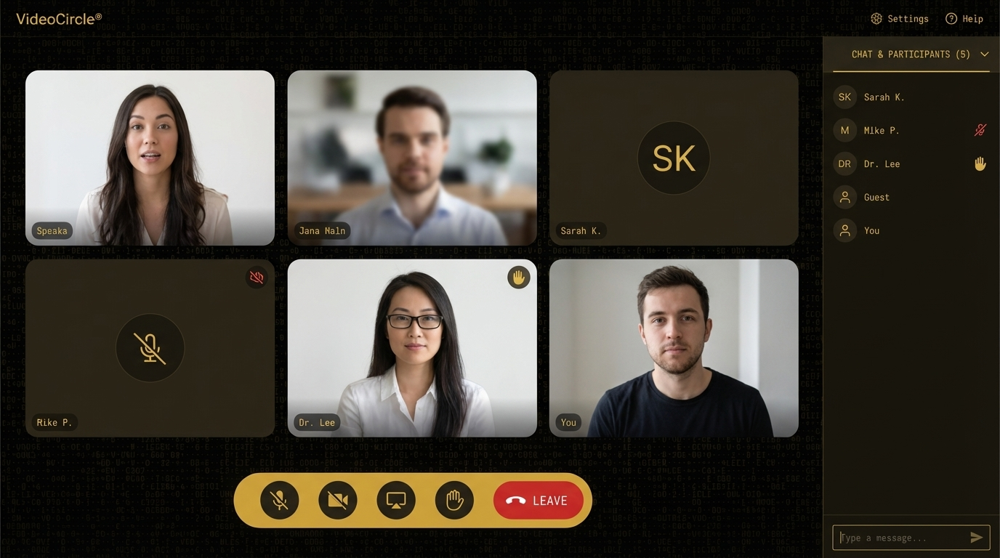

<div align="center">
  

  <h1>VideoCircle</h1>

  <p>A full-stack real-time video conferencing web application built with LiveKit SFU, Express, and React.</p>

  <p>
    <a href="https://zoom-clone-teal-gamma.vercel.app" target="_blank">
      
    </a>
  </p>

  <p>
    
    
    
    
    
  </p>
</div>

---

## Overview

VideoCircle is a full-stack video conferencing application that lets users host and join real-time video calls directly in the browser — no plugins or downloads required. It uses **LiveKit** as the SFU (Selective Forwarding Unit) for media, supporting multi-participant calls with live camera/mic toggling, screen sharing, in-call chat, and a meeting history dashboard.

**Key Features:**

- **Multi-participant video calls** — powered by LiveKit SFU with adaptive bitrate and simulcast
- **Lobby screen** — preview your camera and toggle audio/video before joining a call
- **In-call chat** — real-time data channel messages via LiveKit
- **Screen sharing** — share your screen with all call participants
- **Guest access** — join any meeting without registering
- **Meeting history** — authenticated users can view a log of all past sessions
- **Token-based auth** — secure registration and login with bcrypt-hashed passwords and 7-day session tokens
- **Gold brutalist UI** — distinctive aesthetic with animated ASCII canvas backgrounds, Anton/JetBrains Mono typography, and sharp-cornered bracket-notation controls

---

## Live Demo

**Frontend:** [https://zoom-clone-teal-gamma.vercel.app](https://zoom-clone-teal-gamma.vercel.app)

**Backend:** [https://awake-comfort-production-3879.up.railway.app](https://awake-comfort-production-3879.up.railway.app)

---

## Screenshots

<div align="center">
  
  <p><em>In-call view with video grid, controls, and chat panel</em></p>
</div>

---

## Tech Stack

| Layer                | Technology                                                         |
| -------------------- | ------------------------------------------------------------------ |
| **Frontend**         | React 18, React Router v6, Material-UI v5                          |
| **Video/Audio**      | LiveKit Cloud (SFU), `@livekit/components-react`, `livekit-client` |
| **HTTP Client**      | Axios                                                              |
| **Backend**          | Node.js, Express 5, `livekit-server-sdk`                           |
| **Database**         | MongoDB Atlas (Mongoose ODM)                                       |
| **Authentication**   | Custom token (crypto hex), bcrypt (10 rounds)                      |
| **Process Manager**  | PM2 (production), Nodemon (development)                            |
| **Frontend Hosting** | Vercel                                                             |
| **Backend Hosting**  | Railway (serverless-compatible)                                    |

---

## Architecture & Data Flow

```
┌──────────────────────────────────────────────────────────────────┐
│  React App (Vercel)                                              │
│                                                                  │
│  ┌──────────────────┐   REST (Axios)    ┌─────────────────────┐ │
│  │  Auth / Home /   │ ────────────────► │  Express Backend    │ │
│  │  History Pages   │ ◄──────────────── │  (Railway)          │ │
│  └──────────────────┘  token, history   │                     │ │
│                                         │  MongoDB Atlas      │ │
│  ┌──────────────────┐  GET /get-token   │  ┌───────────────┐  │ │
│  │  MeetPage.jsx    │ ────────────────► │  │ users         │  │ │
│  │  <LiveKitRoom>   │ ◄──── JWT ─────── │  │ meetings      │  │ │
│  └────────┬─────────┘                   └─────────────────────┘ │
│           │  WebRTC + WebSocket (LiveKit SDK)                    │
│           ▼                                                      │
│  ┌──────────────────────────────┐                               │
│  │    LiveKit Cloud (SFU)       │                               │
│  │  Video · Audio · Chat data   │                               │
│  └──────────────────────────────┘                               │
└──────────────────────────────────────────────────────────────────┘
```

### Authentication Flow

1. User registers → password hashed with bcrypt → stored in MongoDB
2. Login → server generates a 40-char hex token with 7-day expiry → returned to client
3. Token stored in `localStorage` (accessed only via `shared/lib/storage.js`); sent as `Authorization: Bearer <token>` by the shared Axios interceptor (`shared/lib/apiClient.js`)
4. The `requireAuth` middleware on the backend validates the token on every protected request; on the frontend the `withAuth` HOC gates protected routes by calling `GET /api/v1/users/verify` on mount

### Video Call Flow

1. User navigates to `/home` → enters a meeting code → navigated to `/:meetingCode`
2. **Lobby screen** — camera/mic preview, name entry, toggle controls
3. `[JOIN]` clicked → frontend fetches a LiveKit JWT from `GET /api/v1/meet/get-token`
4. `<LiveKitRoom>` connects directly to LiveKit Cloud using the JWT (no backend involvement in media)
5. LiveKit SFU handles track subscription, simulcast, and adaptive bitrate automatically
6. Chat messages are sent over LiveKit's data channel via `useChat()`
7. On disconnect, LiveKit SDK cleans up tracks; `onDisconnected` navigates home

---

## Project Structure

The frontend is organized by **feature folders** + a `shared/` cross-cutting layer; the backend follows a **layered architecture** (`config → middleware → modules`).

```
VideoCircle/
├── frontend/                                 # React CRA app (Vercel)
│   ├── public/                               # logo3.png, in_call_experience.png, manifest, …
│   ├── jsconfig.json                         # baseUrl: "src" (cleaner imports)
│   └── src/
│       ├── index.js                          # ReactDOM root, imports tokens.css + globals.css
│       ├── app/
│       │   ├── App.jsx                       # mouse-position listener, mounts <Providers><AppRoutes/>
│       │   ├── providers.jsx                 # <BrowserRouter><ThemeProvider><AuthProvider>
│       │   └── routes.jsx                    # the only place routes are defined
│       ├── features/
│       │   ├── auth/
│       │   │   ├── components/withAuth.jsx   # HOC gating protected routes
│       │   │   ├── context/AuthContext.jsx   # useAuth() — login/register/logout/verify
│       │   │   ├── pages/AuthPage.jsx        # /auth
│       │   │   ├── pages/GuestLandingPage.jsx# /guest
│       │   │   └── services/authApi.js       # register/login/verify
│       │   ├── home/pages/HomePage.jsx       # /home
│       │   ├── history/
│       │   │   ├── pages/HistoryPage.jsx     # /history
│       │   │   └── services/historyApi.js    # get_all_activity / add_to_activity
│       │   ├── landing/pages/LandingPage.jsx # /
│       │   └── meet/
│       │       ├── components/               # LobbyScreen, ConferenceGrid, MeetControls,
│       │       │                             # ChatPanel, LocalVideoPIP
│       │       ├── livekit/RoomShell.jsx     # wraps <LiveKitRoom> + RoomAudioRenderer
│       │       ├── livekit/tokenApi.js       # GET /api/v1/meet/get-token
│       │       ├── livekit/useMeetingRoom.js # lobby | connecting | room phase machine
│       │       ├── pages/MeetPage.jsx        # /:meetingCode
│       │       └── styles/videoComponent.module.css
│       └── shared/
│           ├── hooks/useASCIICanvas.js
│           ├── lib/apiClient.js              # single Axios instance + Authorization interceptor
│           ├── lib/env.js                    # the only file that reads process.env.*
│           ├── lib/storage.js                # wraps localStorage("token")
│           ├── styles/globals.css            # imported once in index.js
│           ├── styles/tokens.css             # CSS custom properties (gold/ink palette)
│           └── theme/goldTheme.js            # MUI theme (wired via providers.jsx)
│
├── backend/                                  # Express 5 ESM (Railway)
│   └── src/
│       ├── app.js                            # boot only — assemble app, mount routes, listen
│       ├── config/
│       │   ├── env.js                        # validates process.env once at boot
│       │   └── db.js                         # mongoose.connect with TLS
│       ├── middleware/
│       │   ├── auth.js                       # requireAuth — Bearer token → req.user
│       │   ├── errorHandler.js               # central { status, message } shaper
│       │   ├── validate.js                   # validate(zodSchema) → req.validated
│       │   └── rateLimit.js                  # named limiters (login, token, …)
│       ├── modules/
│       │   ├── users/
│       │   │   ├── users.routes.js           # limiter → validate → [requireAuth] → controller
│       │   │   ├── users.controller.js       # thin: req.validated → service → res
│       │   │   ├── users.service.js          # business logic
│       │   │   ├── users.validation.js       # Zod schemas
│       │   │   ├── users.model.js            # Mongoose User
│       │   │   └── meeting.model.js          # Mongoose Meeting (history records)
│       │   └── meet/
│       │       ├── meet.routes.js
│       │       ├── meet.controller.js
│       │       ├── meet.service.js           # generateLiveKitToken
│       │       └── meet.validation.js
│       └── utils/
│           ├── AppError.js                   # throwable error with HTTP status
│           ├── tokens.js                     # session-token helpers (40-hex, 7-day TTL)
│           └── logger.js
│
├── CLAUDE.md                                 # repo-wide guide for Claude Code
├── frontend/CLAUDE.md                        # frontend-specific guide
├── backend/CLAUDE.md                         # backend-specific guide
└── README.md
```

> The Vercel project config (`vercel.json`) is intentionally git-ignored — it lives in the Vercel project settings rather than in the repo.

---

## Installation & Setup

### Prerequisites

- Node.js 18+
- npm 9+
- A [MongoDB Atlas](https://www.mongodb.com/atlas) cluster (free tier works)

### 1. Clone the repository

```bash
git clone https://github.com/SidVaidya2005/Zoom-Clone.git
cd Zoom-Clone
```

### 2. Backend setup

```bash
cd backend
npm install
```

Create a `.env` file in the `backend/` directory:

```env
MONGO_URL=mongodb+srv://<username>:<password>@<cluster>.mongodb.net/<dbname>?retryWrites=true&w=majority
PORT=8000
LIVEKIT_API_KEY=<your-livekit-api-key>
LIVEKIT_API_SECRET=<your-livekit-api-secret>
LIVEKIT_URL=wss://<your-livekit-project>.livekit.cloud
```

> **MongoDB Atlas**: Go to **Network Access** and add `0.0.0.0/0` (or your machine's IP) to allow connections.
> **LiveKit**: Create a free project at [livekit.io](https://livekit.io) to get your API key, secret, and WebSocket URL.

Start the backend:

```bash
npm run dev        # Development (nodemon hot reload)
# or
npm start          # Production
```

### 3. Frontend setup

```bash
cd ../frontend
npm install
```

Create a `.env` file in the `frontend/` directory:

```env
REACT_APP_SERVER_URL=http://localhost:8000
REACT_APP_LIVEKIT_URL=wss://<your-livekit-project>.livekit.cloud
```

> `REACT_APP_SERVER_URL` defaults to `http://localhost:8000` if omitted. `REACT_APP_LIVEKIT_URL` is required — the app will not connect to video calls without it.

Start the frontend:

```bash
npm start          # Dev server on http://localhost:3000
```

---

## Usage

| Route           | Description                                   | Auth Required |
| --------------- | --------------------------------------------- | ------------- |
| `/`             | Landing page                                  | No            |
| `/auth`         | Register or login                             | No            |
| `/home`         | Enter a meeting code to join or start a call  | Yes           |
| `/guest`        | Join a meeting as a guest (no account needed) | No            |
| `/:meetingCode` | Live video call room                          | No            |
| `/history`      | View all past meetings                        | Yes           |

### Joining a call

1. Open the app and click **[JOIN AS GUEST]** or log in.
2. Enter any meeting code (e.g., `my-team-standup`).
3. On the lobby screen, preview your camera, toggle camera/mic, enter your name.
4. Click **[JOIN]** to enter the call.
5. Share the same URL with others — they join instantly.

---

## Environment Variables

### Backend (`backend/.env`)

| Variable             | Required | Description                                |
| -------------------- | -------- | ------------------------------------------ |
| `MONGO_URL`          | Yes      | MongoDB Atlas connection string            |
| `LIVEKIT_API_KEY`    | Yes      | LiveKit project API key                    |
| `LIVEKIT_API_SECRET` | Yes      | LiveKit project API secret                 |
| `LIVEKIT_URL`        | Yes      | LiveKit server WebSocket URL (`wss://...`) |
| `PORT`               | No       | Server port (default: `8000`)              |

### Frontend (`frontend/.env` or Vercel env)

| Variable                | Required | Description                                         |
| ----------------------- | -------- | --------------------------------------------------- |
| `REACT_APP_SERVER_URL`  | No       | Backend base URL (default: `http://localhost:8000`) |
| `REACT_APP_LIVEKIT_URL` | Yes      | LiveKit server WebSocket URL (`wss://...`)          |

---

## API Endpoints

All routes are rate limited to **100 requests per 15 minutes** per IP.

**`/api/v1/users`** — Auth & history:

| Method | Endpoint            | Auth         | Description                              |
| ------ | ------------------- | ------------ | ---------------------------------------- |
| `POST` | `/register`         | No           | Create a new account                     |
| `POST` | `/login`            | No           | Authenticate and receive a session token |
| `GET`  | `/verify`           | Bearer token | Validate an existing session token       |
| `POST` | `/add_to_activity`  | Bearer token | Log a meeting to history                 |
| `GET`  | `/get_all_activity` | Bearer token | Fetch all meetings for the current user  |

**`/api/v1/meet`** — LiveKit:

| Method | Endpoint     | Auth | Query params       | Description                                        |
| ------ | ------------ | ---- | ------------------ | -------------------------------------------------- |
| `GET`  | `/get-token` | No   | `room`, `username` | Issue a short-lived LiveKit JWT for joining a room |

### Request/Response Examples

**POST `/register`**

```json
// Request
{ "name": "Jane Doe", "username": "janedoe", "password": "secret123" }

// Response 200
{ "message": "User registered successfully" }
```

**POST `/login`**

```json
// Request
{ "username": "janedoe", "password": "secret123" }

// Response 200
{ "token": "a3f9c2d1...", "username": "janedoe", "name": "Jane Doe" }
```

**GET `/get_all_activity`**

```json
// Response 200
[
  { "meetingCode": "my-team-standup", "date": "2026-03-30T10:00:00.000Z" },
  { "meetingCode": "design-review", "date": "2026-03-28T15:30:00.000Z" }
]
```

---

## Deployment

### Frontend (Vercel)

The frontend is deployed as a static React build on Vercel. The `vercel.json` config (kept outside the repo, in Vercel project settings) points the build at the `frontend/` package:

```json
{
  "buildCommand": "cd frontend && npm install && npm run build",
  "outputDirectory": "frontend/build",
  "installCommand": "echo 'skip root install'"
}
```

Set the following environment variables in your Vercel project settings:

- `REACT_APP_SERVER_URL` — your backend URL
- `REACT_APP_LIVEKIT_URL` — your LiveKit server WebSocket URL (`wss://...`)

### Backend (Railway / any Node.js host)

The backend is a standard Express REST API with no persistent WebSocket connections — it is fully **serverless-compatible** and can be deployed anywhere Node.js runs.

Recommended hosts: **Railway**, **Render**, **Fly.io**, **Vercel Functions**, **AWS Lambda**.

```bash
# Production start command
npm start
# or with PM2
npm run prod
```

---

## Contributing

Contributions are welcome! To get started:

1. Fork the repository
2. Create a feature branch: `git checkout -b feature/your-feature`
3. Commit your changes: `git commit -m "feat: add your feature"`
4. Push to your branch: `git push origin feature/your-feature`
5. Open a pull request

Please follow the existing code style (gold brutalist UI design, bracket-notation controls, JetBrains Mono typography) when contributing frontend changes.

---

## License

This project is licensed under the **ISC License**.

---

## Author

**Siddarth Vaidya**

- GitHub: [@SidVaidya2005](https://github.com/SidVaidya2005)

---

<div align="center">
  <sub>Built with React, Express, and LiveKit</sub>
</div>
